author: Pablo Crespo Cervantes
summary: Resumen del CodeLab 
id: Proyecto-bastionado-2 
categories: codelab,markdown 
environments: Web 
status: Published 
 

# Proyecto Bastionado 2

## Que vamos a ver

En este documento veremos como se puede configurar un sistema informático para que un actor malicioso no pueda alterar la secuencia de arranque con fines de acceso ilegítimo

Durante esta documentación podremos ver las siguientes configuraciones:

- Ocultación del arranque
- Contraseña de arranque 
- Copia de seguridad
- Otras opciones de seguridad

## Ocultación del arranque

Cuando instalamos un sistema operativo Linux se nos instala de serie un gestor de arranque llamado GRUB, este programa tiene algunas brechas de seguridad que un usuario malintencionado puede aprovechar para acceder a ficheros con información sensible. En esta parte de la documentación vamos a ver como podemos evitar el acceso a este para que el sistema arranque directamente.

Es recomendable hacer una copia de seguridad de los archivos que vamos a modificar para mantener los originales por si surgiera algun problema, podemos realizarlos usando el siguiente comando si estamos en el directorio: 

```sh
cd /etc/default
cp grub grub.backup
```

Para ocultar el arranque deberemos de modificar la linea de comando que veremos a continuacion en el fichero /etc/grub.d/30_os-prober

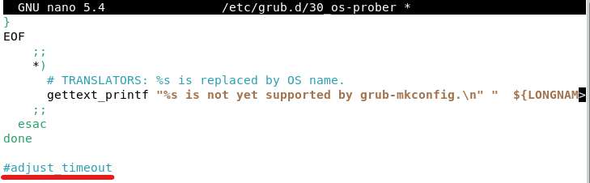

Por ultimo modificaremos el fichero /etc/default/grub, y cambiaremos las lineas Grub_Timeout = 10 y  GRUB_DISABLE_OS_PROBER tal como vemos en la siguiente imagen


una vez terminado y guardado los cambios podemos ejecutar sudo update-grub para que los cambios se efectuen.

## Contraseña de arranque

El siguiente metodo de securización que utilizaremos sera la implantación de una contraseña en el arranque la cual se nos pedira cuando intentemos iniciar el equipo.

Lo primero que haremos para la configuración sera generar una contraseña segura que utilizaremos en el arranque para ello utilizaremos un comando que tiene grub el cual nos generara una contraseña con hash a partir de la que pongamos nosotros como usuarios.

```sh
grub-mkpasswd-pbkdf2
```

como podemos ver en la siguiente imagen una vez escribamos la contraseña nos aparecera el resultado.

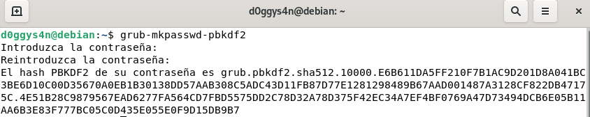
Una vez tenemos esta contraseña podemos ir al fichero /etc/grub.d/40_custom para añadir las siguientes lineas que nos permitiran configurar el usuario con la contraseña generada anteriormente

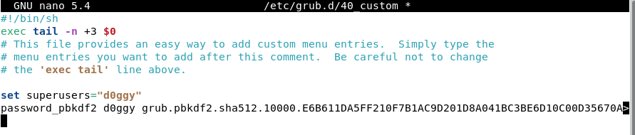
Por ultimo tendremos que hacer un update a grub para que se almacenen los cambios que hemos realizado en los ficheros anteriormente mencionados, para ello utilizaremos el comando

```sh
update-grub
```

Como podemos ver al reiniciar tras actualizar grub nos aparecera la ventana de inicio de sesión (especifica de grub).


#### Configurar usuario

Hemos visto como generar un superusuario con contraseña el cual nos permitira proteger grub pero es posible segun la configuracion que estemos haciendo que solo queramos generar un usuario normal para ello deberemos seguir los mismos pasos pero tendremos que modificar la entrada de menu para darle acceso al usuario con el que estemos trabajando.

Vamos a crear otro usuario dentro del fichero 40_custom pero esta vez usaremos una contraseña con texto plano para comprobar que tambien funciona.

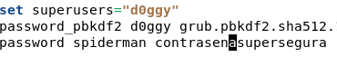
Tras esto iremos al fichero de configuracion 10_linux donde estan las menuentry 

## Copia de seguridad Grub

Para crear una copia de seguridad actualmente debemos de copiar/restaurar varios archivos, antiguamente con grub solo hacia falta recuperar errl archivo /boot/grub/menu.lst pero con grub 2 deberemos de recuperar los siguientes archivos/directorios

- /etc/default/grub
- /etc/grub.d/
- /boot/grub/grub.cfg

Esta copia de seguridad podremos hacerlo de dos formas que ahora veremos

podemos hacer un comando que nos haga un archivo comprimido con la información que necesitamos almacenar.

```sh
sudo tar zcvf grub2_(fecha).tar /etc/default/grub /etc/grub.d/  /boot/grub/grub.cfg
```

tambien podremos hacer un tar de estos archivos a traves de un pequeño script que automatice esta tarea.

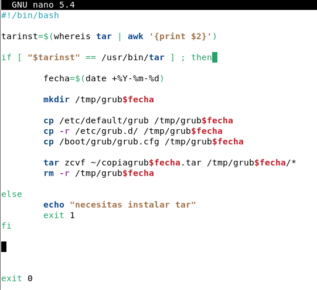

## Otras opciones de seguridad

Como metodo extra para proteger el arranque podremos cifrar el disco obligando al usuario a introducir la contraseña de desencriptacion del disco duro antes de poder operar, este tipo de configuracion debe hacerse durante la instalación debido por lo que realizaremos una instalación de debian desde 0 para ver los pasos.

Una vez lleguemos al paso para configurar las particiones podremos configurar lois volumenes cifrados en la opcion que vemos en la siguiente imagen

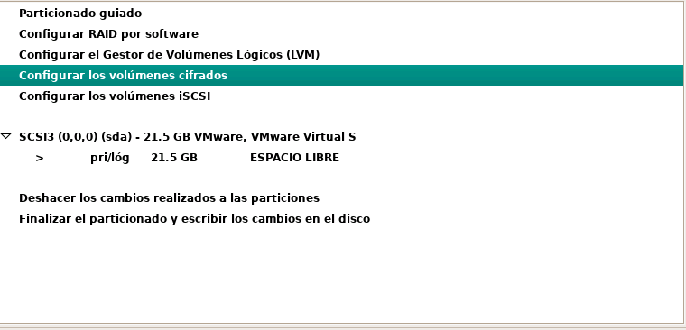
Nos mostrara una alerta diciendo que vamos a mopdificar las particiones del dispositivo.

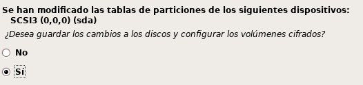
Tras esto podremos seleccionar los dispositivos que vamos a cifrar y nos permitira elegir si queremos configurar una contraseña nosotros mismos o si queremos que nos genere una aleatoriamente

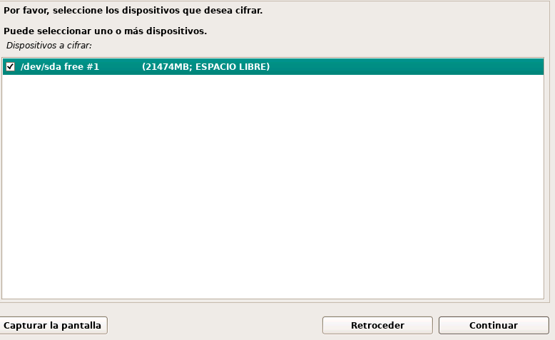
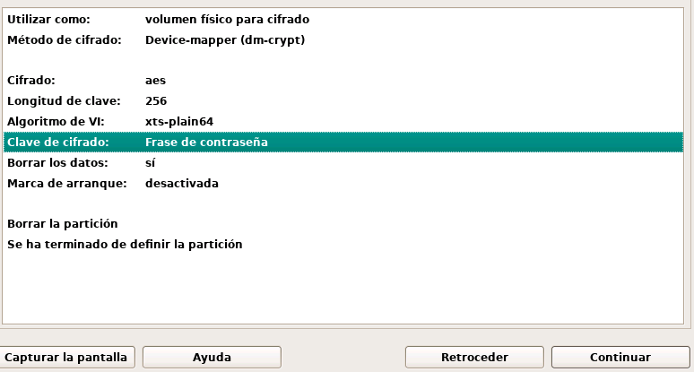
para finalizar elegiremos una contraseña que se adecue a las necesidades de seguridad y terminaremos de configurar la instalación

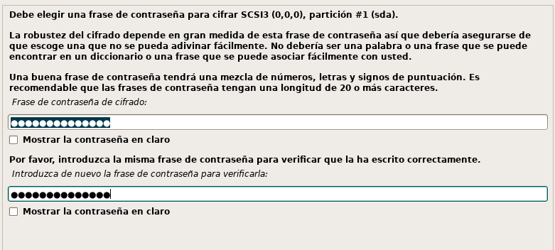
tras esto podremos ver en el siguiente arranque el mensaje que nos pedira desencriptar el disco duro.

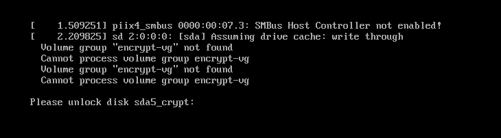
